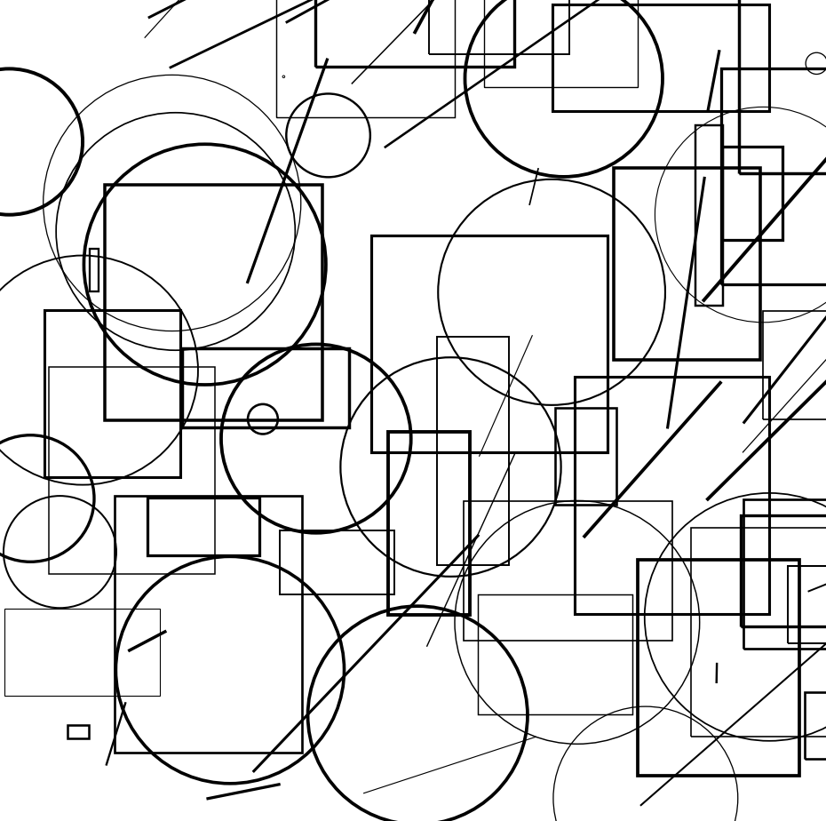

<h1>abstract_art</h1>

A simple, yet interesting program that creates random abstract images.

<h2>Setup</h2>
<ol>
    <li>Clone the repository:
        <pre><code>git clone https://github.com/eard3n1/zar_at_bot.git</code></pre>
    </li>
     
    <li>Install matplotlib if you don't have it already:
        <pre><code>pip install matplotlib</code></pre>
    </li>
     
    <li>Run the program:
        <pre><code>python main.py</code></pre>   
    </li>
</ol>

<h2>License</h2>

MIT License

